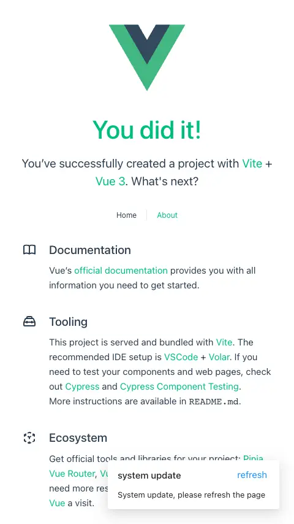
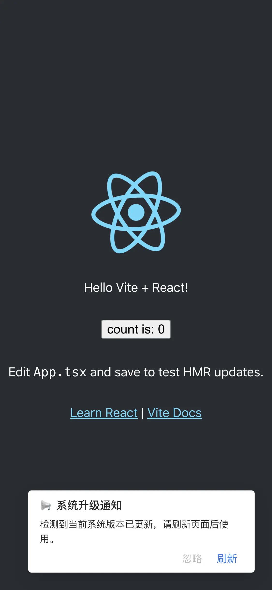
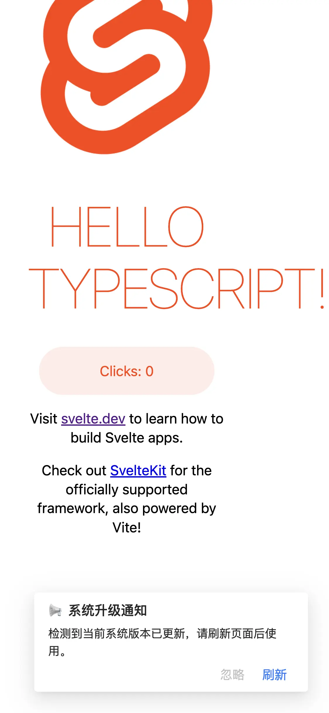
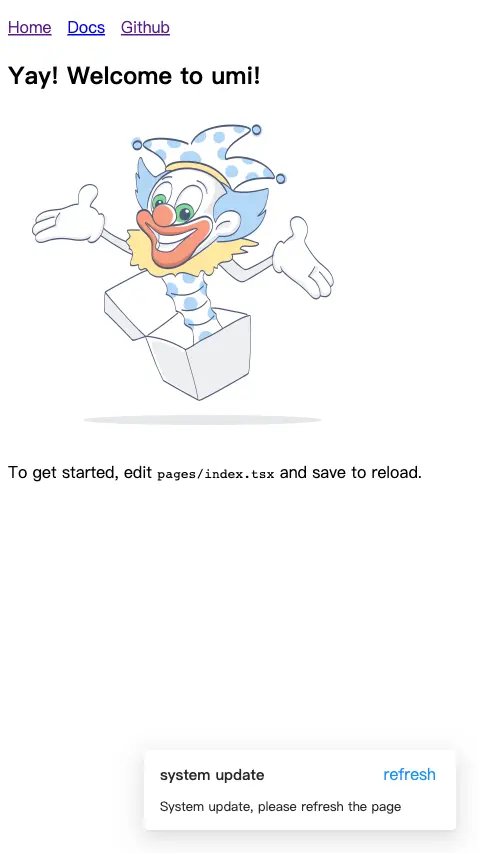

English | [简体中文](./README.zh-CN.md)

# plugin-web-update-notification

<p align="center">
    <a href="https://unpkg.com/browse/vite-plugin-web-update-notification/dist/webUpdateNoticeInjectScript.js">
      
    </a>
    <a href="https://www.npmjs.com/package/vite-plugin-web-update-notification">
      
    </a>
    <a href="https://github.com/GreatAuk/vite-plugin-web-update-notification/blob/master/LICENSE">
      
    </a>
    <a href="https://github.com/GreatAuk/vite-plugin-web-update-notification/discussions">
      
    </a>
    <br>
</p>


Detect webpage updates and notify user to reload. support vite and umijs.

> Take the git commit hash as the version number, and write hash into json file. The client polls the git commit hash of the server (visibilitychange event assistant), compares it with the local one, and if it is not the same, notifies the user to refresh the page.

<p align="center">
  
  
  
  
</p>

## Why

Some users do not have the habit of closing web pages. If the front-end page is updated, the user page may report an error (file 404) or a white screen.

## Install

```bash
# vite
pnpm add vite-plugin-web-update-notification -D

# umijs
pnpm add umijs-plugin-web-update-notification -D
```

## Usage

### Vite

```ts
// vite.config.ts
import { defineConfig } from 'vite'
import vue from '@vitejs/plugin-vue'
import { webUpdateNotice } from 'vite-plugin-web-update-notification'

// https://vitejs.dev/config/
export default defineConfig({
  plugins: [
    vue(),
    webUpdateNotice({
      logHash: true,
    }),
  ]
})
```

```ts
// vite.config.ts
export default defineConfig({
  plugins: [
    vue(),
    webUpdateNotice({
      // custom notification text
      notificationProps: {
        title: 'system update',
        description: 'System update, please refresh the page',
        buttonText: 'refresh',
      },
    }),
  ]
})
```

```ts
// vite.config.ts
export default defineConfig({
  plugins: [
    vue(),
    webUpdateNotice({
      // custom notification UI
      customNotificationHTML: `
        <div style="background-color: #fff;padding: 24px;border-radius: 4px;position: fixed;top: 24px;right: 24px;border: 1px solid;">
          System update, please refresh the page
        </div>
      `,
    }),
  ]
})
```

```ts
// hidden default notification, listener to update event custom behavir.
// vite.config.ts
export default defineConfig({
  plugins: [
    vue(),
    webUpdateNotice({
      hiddenDefaultNotification: true
    }),
  ]
})

// other file to listener custom update event
document.body.addEventListener('system_update_plugin_web_update_notification', (options) => {
  console.log(options)
  alert('System update!')
})
```

### Umijs

```ts
// .umirc.ts
import { defineConfig } from 'umi'
import type { Options as WebUpdateNotificationOptions } from 'umijs-plugin-web-update-notification'

export default {
  plugins: ['umijs-plugin-web-update-notification'],
  webUpdateNotification: {
    logHash: true,
    checkInterval: 0.5 * 60 * 1000,
    notificationProps: {
      title: 'system update',
      description: 'System update, please refresh the page',
      buttonText: 'refresh',
    },
  } as WebUpdateNotificationOptions
}
```

## Options

```ts
function webUpdateNotice(options?: Options): Plugin

interface Options {
  /** polling interval（ms）, default 10*60*1000 */
  checkInterval?: number
  /** whether to output commit-hash in console */
  logHash?: boolean
  customNotificationHTML?: string
  notificationProps?: NotificationProps
  hiddenDefaultNotification?: boolean
}

interface NotificationProps {
  title?: string
  description?: string
  buttonText?: string
}
```

## License

[MIT](./LICENSE)
