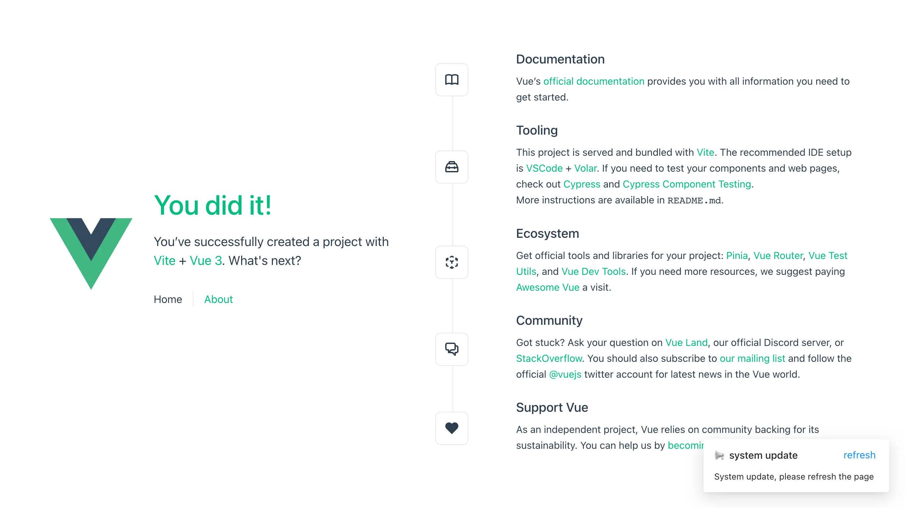

[English](./README.md) | 简体中文

# vite-plugin-web-update-notification

检测网页更新并通知用户刷新

> 以 git commit hash 为版本号。客户端轮询服务器（visibilitychange 事件辅助）的 git commit hash , 和本地作比较，如果不相同则通知用户刷新页面。



## 安装

```bash
npm add vite-plugin-web-update-notification -D
# yarn add vite-plugin-web-update-notification -D
# pnpm add vite-plugin-web-update-notification -D
```

## 快速上手

```ts
// vite.config.ts
import { defineConfig } from 'vite'
import vue from '@vitejs/plugin-vue'
import { webUpdateNotice } from 'vite-plugin-web-update-notification'

// https://vitejs.dev/config/
export default defineConfig({
  plugins: [
    vue(),
    webUpdateNotice({
      logHash: true,
    }),
  ]
})
```

```ts
// vite.config.ts
export default defineConfig({
  plugins: [
    vue(),
    webUpdateNotice({
      // 自定义通知栏文本
      notificationProps: {
        title: 'system update',
        description: 'System update, please refresh the page',
        buttonText: 'refresh',
      },
    }),
  ]
})
```

```ts
// vite.config.ts
export default defineConfig({
  plugins: [
    vue(),
    webUpdateNotice({
      // 自定义 notification UI
      customNotificationHTML: `
        <div style="background-color: #fff;padding: 24px;border-radius: 4px;position: fixed;top: 24px;right: 24px;border: 1px solid;">
          System update, please refresh the page
        </div>
      `,
    }),
  ]
})
```

## Options

```ts
function webUpdateNotice(options?: Options): Plugin

interface Options {
  /** 轮询间隔（ms）, 默认 10*60*1000 */
  checkInterval?: number
  /** 是否在浏览器控制台输出 commit-hash */
  logHash?: boolean
  customNotificationHTML?: string
  notificationProps?: NotificationProps
}

interface NotificationProps {
  title?: string
  description?: string
  buttonText?: string
}
```

## License

[MIT](./LICENSE)
