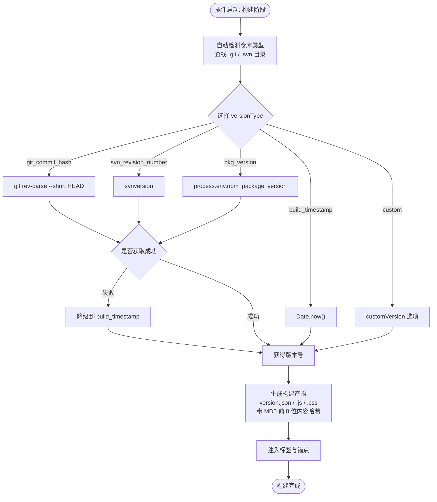
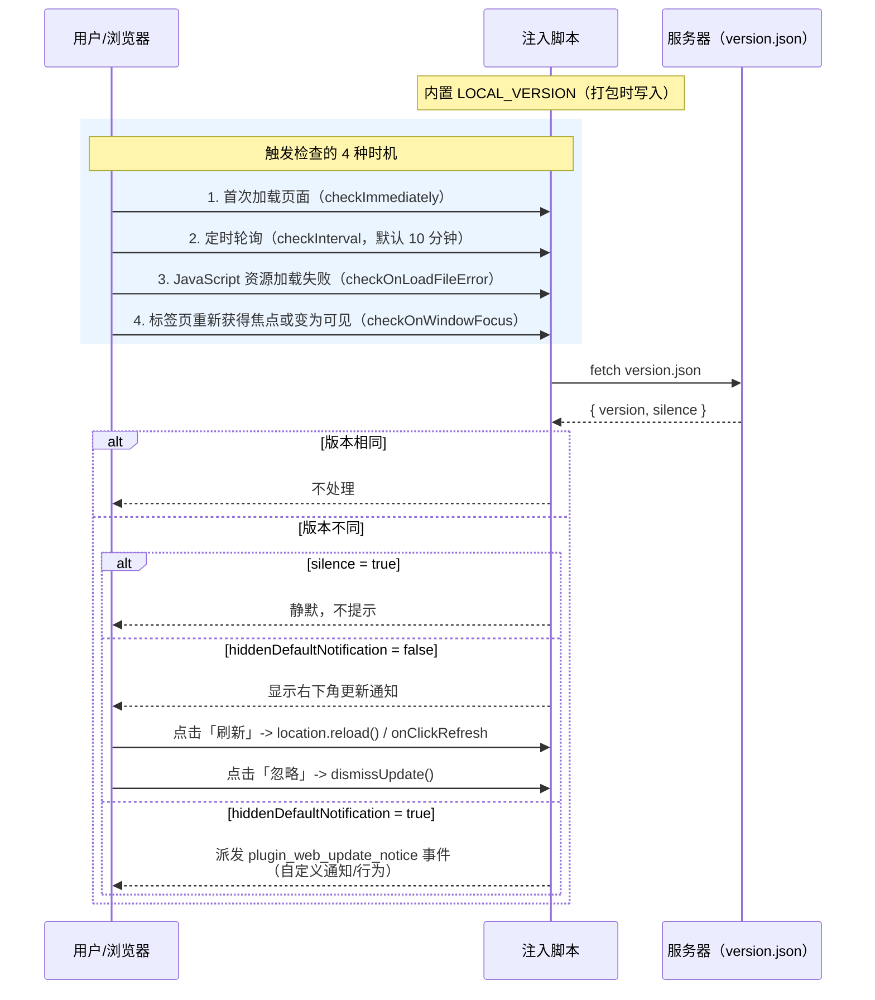

[English](./README.md) | 简体中文

# plugin-web-update-notification

<p align="center">
    <a href="https://unpkg.com/@plugin-web-update-notification/core/dist/webUpdateNoticeInjectScript.js" target="__blank">
      
    </a>
    <a href="https://www.npmjs.com/package/@plugin-web-update-notification/core" target="__blank">
      
    </a>
    <a href="https://www.npmjs.com/package/@plugin-web-update-notification/core" target="__blank"></a>
    <a href="https://github.com/GreatAuk/plugin-web-update-notification/blob/main/LICENSE">
      
    </a>
    <a href="https://github.com/GreatAuk/plugin-web-update-notification/discussions" target="__blank">
      
    </a>
    <br>
</p>

<p align="center">
  <a href="https://zread.ai/GreatAuk/plugin-web-update-notification" target="_blank"></a>
  <a href="https://deepwiki.com/GreatAuk/plugin-web-update-notification"></a>
</p>

检测已部署网页的版本变化，并提示用户刷新页面。支持 Vite、UmiJS、Webpack、Rspack 和 Nuxt。

构建时，插件将 Git 提交哈希、SVN 修订号、`package.json` 版本号、构建时间戳或自定义值写入版本文件。运行时，客户端获取服务器端版本，并与页面内置版本比较；版本不一致时，将提示用户刷新页面。

<p align="center">
  
  
  
  
</p>

## 检测时机

插件会在下列时机请求 `version.json`：

1. 首次加载页面时。
2. 定时轮询时，默认间隔为 10 分钟。
3. JavaScript 资源加载失败时，例如资源返回 `404`。
4. 标签页 refocus or revisible。

## 查看更新提示

使用默认配置安装插件后，完成构建并部署。打开网页并保持该标签页处于打开状态，然后修改代码、重新构建并再次部署。在 Git 仓库中，默认的 `versionType` 为 `git_commit_hash`，因此需要提交新的 Git commit 才会产生新版本号。重新进入原标签页后，页面右下角会显示更新提示。

插件仅在生产构建中生效，开发模式不会注入更新检测逻辑。

## 工作原理

### 构建时（版本获取策略）


```mermaid
flowchart TD
    Start([插件启动: 构建阶段]) --> Detect[自动检测仓库类型<br/>查找 .git / .svn 目录]
    Detect --> Type{选择 versionType}

    Type -->|git_commit_hash| Git["git rev-parse --short HEAD"]
    Type -->|svn_revision_number| Svn["svnversion"]
    Type -->|pkg_version| Pkg["process.env.npm_package_version"]
    Type -->|build_timestamp| Ts["Date.now()"]
    Type -->|custom| Custom["customVersion 选项"]

    Git --> Check{是否获取成功}
    Svn --> Check
    Pkg --> Check
    Check -->|失败| Fallback[降级到 build_timestamp]
    Check -->|成功| Version[获得版本号]
    Ts --> Version
    Custom --> Version
    Fallback --> Version

    Version --> Emit[生成构建产物<br/>version.json / .js / .css<br/>带 MD5 前 8 位内容哈希]
    Emit --> Inject[注入标签与锚点]
    Inject --> End([构建完成])
```

### 运行时（检测时机与动作）


```mermaid
sequenceDiagram
    participant U as 用户/浏览器
    participant S as 注入脚本
    participant Srv as 服务器（version.json）

    Note over S: 内置 LOCAL_VERSION（打包时写入）

    rect rgb(235, 245, 255)
    Note over U,S: 触发检查的 4 种时机
    U->>S: 1. 首次加载页面（checkImmediately）
    U->>S: 2. 定时轮询（checkInterval，默认 10 分钟）
    U->>S: 3. JavaScript 资源加载失败（checkOnLoadFileError）
    U->>S: 4. 标签页重新获得焦点或变为可见（checkOnWindowFocus）
    end

    S->>Srv: fetch version.json
    Srv-->>S: { version, silence }

    alt 版本相同
        S-->>U: 不处理
    else 版本不同
        alt silence = true
            S-->>U: 静默，不提示
        else hiddenDefaultNotification = false
            S-->>U: 显示右下角更新通知
            U->>S: 点击「刷新」-> location.reload() / onClickRefresh
            U->>S: 点击「忽略」-> dismissUpdate()
        else hiddenDefaultNotification = true
            S-->>U: 派发 plugin_web_update_notice 事件<br/>（自定义通知/行为）
        end
    end
```

## 适用场景

用户可能长期不关闭网页。前端发布新版本后，旧页面仍可能引用已移除的资源，导致资源 `404`、页面异常或白屏。该插件可在检测到版本变化时提示用户刷新，以减少这类问题。

## 安装

> **仅支持 ESM：**当前版本仅支持 ESM。如果你的项目仍依赖 CommonJS，请安装 `1.8.1` 版本。

```bash
# Vite
pnpm add @plugin-web-update-notification/vite -D

# UmiJS
pnpm add @plugin-web-update-notification/umijs -D

# Webpack 插件
pnpm add @plugin-web-update-notification/webpack -D

# Rspack 插件
pnpm add @plugin-web-update-notification/rspack -D

# Nuxt 模块
pnpm add @plugin-web-update-notification/nuxt -D
```

## 使用

[Vite](#vite) | [UmiJS](#umijs) | [Webpack](#webpack) | [Rspack](#rspack) | [Nuxt](#nuxt)

### 禁用 `index.html` 缓存

请确保 `index.html` 不被缓存。否则用户刷新页面后仍可能加载旧的入口文件，导致更新提示持续出现。对于单页应用（SPA），这也是推荐的部署方式。

在 Nginx 中禁用缓存：

```nginx
# nginx.conf
location / {
  index index.html index.htm;

  if ( $uri = '/index.html' ) { # 禁用 index.html 缓存
    add_header Cache-Control "no-cache, no-store, must-revalidate";
  }

  try_files $uri $uri/ /index.html;
}
```

也可以通过 HTML 的 `meta` 标签禁用缓存：

```html
<!DOCTYPE html>
<html lang="en">
  <head>
    <meta http-equiv="Cache-Control" content="no-cache, no-store, must-revalidate" />
    <meta http-equiv="Pragma" content="no-cache" />
    <meta http-equiv="Expires" content="0" />
  </head>
</html>
```

### Vite

**基础使用**

```ts
// vite.config.ts
import { defineConfig } from 'vite'
import vue from '@vitejs/plugin-vue'
import { webUpdateNotice } from '@plugin-web-update-notification/vite'

// https://vitejs.dev/config/
export default defineConfig({
  plugins: [
    vue(),
    webUpdateNotice({
      logVersion: true,
    }),
  ],
})
```

**自定义通知文案**

```ts
// vite.config.ts
export default defineConfig({
  plugins: [
    vue(),
    webUpdateNotice({
      notificationProps: {
        title: '标题',
        description: 'System update, please refresh the page',
        buttonText: '刷新',
        dismissButtonText: '忽略',
      },
    }),
  ],
})
```

**国际化**

```ts
// vite.config.ts
export default defineConfig({
  plugins: [
    vue(),
    webUpdateNotice({
      // 内置语言：zh_CN | zh_TW | en_US
      locale: 'en_US',
      localeData: {
        en_US: {
          title: '📢 system update',
          description: 'System update, please refresh the page',
          buttonText: 'refresh',
          dismissButtonText: 'dismiss',
        },
        zh_CN: {
          ...
        },
        ...
      },
    }),
  ],
})

// 在其他文件中切换语言
window.pluginWebUpdateNotice_.setLocale('zh_CN')
```

**隐藏默认通知并自定义处理逻辑**

```ts
// vite.config.ts
export default defineConfig({
  plugins: [
    vue(),
    webUpdateNotice({
      hiddenDefaultNotification: true,
    }),
  ],
})

// 在其他文件中监听自定义更新事件
document.body.addEventListener('plugin_web_update_notice', (e) => {
  const { version, options } = e.detail
  // 显示自定义通知，或执行其他业务逻辑。
  alert('System update!')
})
```

### UmiJS

不支持 Umi 2。Umi 2 项目可尝试通过 `chainWebpack` 配置 Webpack 插件。

```ts
// .umirc.ts
import { defineConfig } from 'umi'
import type { Options as WebUpdateNotificationOptions } from '@plugin-web-update-notification/umijs'

export default {
  plugins: ['@plugin-web-update-notification/umijs'],
  webUpdateNotification: {
    versionType: 'git_commit_hash',
    logVersion: true,
    checkInterval: 0.5 * 60 * 1000,
    notificationProps: {
      title: 'system update',
      description: 'System update, please refresh the page',
      buttonText: 'refresh',
      dismissButtonText: 'dismiss',
    },
  } as WebUpdateNotificationOptions,
}
```

### Webpack

```js
// vue.config.js(vue-cli project)
const { WebUpdateNotificationPlugin } = require('@plugin-web-update-notification/webpack')
const { defineConfig } = require('@vue/cli-service')

module.exports = defineConfig({
  // ...other config
  configureWebpack: {
    plugins: [
      new WebUpdateNotificationPlugin({
        logVersion: true,
      }),
    ],
  },
})
```

### Rspack

```js
// rspack.config.js
const { HtmlRspackPlugin } = require('@rspack/core')
const { WebUpdateNotificationPlugin } = require('@plugin-web-update-notification/rspack')

module.exports = {
  plugins: [
    new HtmlRspackPlugin(),
    new WebUpdateNotificationPlugin({
      logVersion: true,
    }),
  ],
}
```

该插件也支持 **Rsbuild**：

```ts
// rsbuild.config.ts
import { defineConfig } from '@rsbuild/core'
import { WebUpdateNotificationPlugin } from '@plugin-web-update-notification/rspack'

export default defineConfig({
  tools: {
    rspack: {
      plugins: [
        new WebUpdateNotificationPlugin({
          logVersion: true,
        }),
      ],
    },
  },
})
```

### Nuxt

```ts
// nuxt.config.ts
export default defineNuxtConfig({
  modules: ['@plugin-web-update-notification/nuxt'],
  webUpdateNotification: {
    logVersion: true,
  },
})
```

支持 SSG（`nuxt generate`）、SPA（`ssr: false`）和 SSR（`nuxt build`）三种模式。该模块仅在生产构建时生效，开发模式下不会启用。

## 配置项

````ts
function webUpdateNotice(options?: Options): Plugin

export interface Options {
  /**
   * 版本号类型：'git_commit_hash' | 'svn_revision_number' | 'pkg_version' | 'build_timestamp' | 'custom'
   * - Git 仓库默认使用 'git_commit_hash'。
   * - SVN 仓库默认使用 'svn_revision_number'。
   * - 未识别的仓库默认使用 'build_timestamp'。
   * */
  versionType?: VersionType
  /**
   * 自定义版本号。versionType 为 'custom' 时必填。
   */
  customVersion?: string
  /** 轮询间隔，单位为 ms。
   * 设置为 0 时不轮询。
   * @default 10 * 60 * 1000
   */
  checkInterval?: number
  /**
   * 窗口重新获得焦点时检测更新。
   * @default true
   */
  checkOnWindowFocus?: boolean
  /**
   * 页面加载完成后立即检测更新。
   * @default true
   */
  checkImmediately?: boolean
  /**
   * JavaScript 文件加载失败时检测更新。
   * @default true
   */
  checkOnLoadFileError?: boolean
  /**
   * 是否在控制台输出版本号。
   *
   * 也可传入函数以自定义版本号的处理方式。
   * ```ts
   * logVersion: (version) => {
   *   console.log(`version: %c${version}`, 'color: #1890ff') // 默认行为
   * }
   * ```
   * @default true
   */
  logVersion?: boolean | ((version: string) => void)
  /**
   * 是否静默更新通知。
   * 例如，当前版本为 v1.0 时，可为 v1.0.1 设置 true。用户升级到该版本时不会看到通知。
   */
  silence?: boolean
  /**
   * @deprecated
   */
  customNotificationHTML?: string
  /** notificationProps 的优先级高于 locale。 */
  notificationProps?: NotificationProps
  notificationConfig?: NotificationConfig
  /**
   * 内置语言：zh_CN | zh_TW | en_US
   * @default 'zh_CN'
   * */
  locale?: string
  /**
   * 自定义语言数据。
   * @link 默认数据：https://github.com/GreatAuk/plugin-web-update-notification/blob/main/packages/core/src/locale.ts
   */
  localeData?: LocaleData
  /**
   * 是否隐藏默认通知。设置为 true 后，需要自行处理更新事件。
   * ```ts
    document.body.addEventListener('plugin_web_update_notice', (e) => {
      const { version, options } = e.detail
      // 显示自定义通知，或执行其他业务逻辑。
      alert('System update!')
    })
   * ```
   * @default false
   */
  hiddenDefaultNotification?: boolean
  /**
   * 是否隐藏忽略按钮。
   * @default false
   */
  hiddenDismissButton?: boolean
  /**
   * 自 1.2.0 版本起，通常无需设置该项。插件会自动读取 Vite 的 base、Webpack 的 publicPath 或 Umi 的 publicPath。
   *
   * 注入文件的公共基础路径，可取：
   * - 绝对路径，如 /foo/。
   * - 完整 URL，如 https://foo.com/。
   * - 空字符串（默认值）或 ./。
   *
   * 路径末尾必须保留 /。
   */
  injectFileBase?: string
}

export type VersionType =
  | 'git_commit_hash'
  | 'svn_revision_number'
  | 'pkg_version'
  | 'build_timestamp'
  | 'custom'

export interface NotificationConfig {
  /**
   * 刷新按钮颜色。
   * @default '#1677ff'
   */
  primaryColor?: string
  /**
   * 忽略按钮颜色。
   * @default 'rgba(0,0,0,.25)'
   */
  secondaryColor?: string
  /** @default 'bottomRight' */
  placement?: 'topLeft' | 'topRight' | 'bottomLeft' | 'bottomRight'
}

export interface NotificationProps {
  title?: string
  description?: string
  /** 刷新按钮文案。 */
  buttonText?: string
  /** 忽略按钮文案。 */
  dismissButtonText?: string
}

export type LocaleData = Record<string, NotificationProps>
````

## 运行时方法

| 方法                                              | 参数                                  | 说明                                           |
| ------------------------------------------------- | ------------------------------------- | ---------------------------------------------- |
| `window.pluginWebUpdateNotice_.setLocale`         | `locale`：`zh_CN`、`zh_TW` 或 `en_US` | 设置通知语言。                                 |
| `window.pluginWebUpdateNotice_.closeNotification` | —                                     | 关闭通知。                                     |
| `window.pluginWebUpdateNotice_.dismissUpdate`     | —                                     | 忽略当前更新并关闭通知，行为与“忽略”按钮一致。 |
| `window.pluginWebUpdateNotice_.checkUpdate`       | —                                     | 手动检测更新。该方法内置 5,000 ms 防抖。       |

```ts
interface Window {
  pluginWebUpdateNotice_: {
    /**
     * 设置通知语言。
     * 内置语言：zh_CN、zh_TW、en_US。
     */
    setLocale: (locale: string) => void
    /**
     * 手动检测更新。该方法内置 5,000 ms 防抖。
     */
    checkUpdate: () => void
    /** 忽略当前更新并关闭通知，行为与“忽略”按钮一致。 */
    dismissUpdate: () => void
    /** 关闭通知。 */
    closeNotification: () => void
    /**
     * 刷新按钮点击事件。设置后会覆盖默认的 location.reload() 行为。
     */
    onClickRefresh?: (version: string) => void
    /**
     * 忽略按钮点击事件。设置后会覆盖默认的 dismissUpdate() 行为。
     */
    onClickDismiss?: (version: string) => void
  }
}
```

## 构建产物

构建完成后，插件会在输出目录生成版本文件、检测脚本和样式文件，并将它们注入 HTML。


## 常见问题

1. 如何获得 `TypeScript` 类型提示？

   如果需要调用 `window.pluginWebUpdateNotice_`，或监听自定义更新事件，请在项目中添加对应插件包的类型引用：

   ```ts
   // src/shim.d.ts

   // 使用 Vite 插件时
   /// <reference types="@plugin-web-update-notification/vite" />

   // 使用 Umi 插件时
   /// <reference types="@plugin-web-update-notification/umijs" />

   // 使用 Webpack 插件时
   /// <reference types="@plugin-web-update-notification/webpack" />
   ```

2. 请求 `version.json` 时返回 `404`，如何处理？

   将构建产物部署到 CDN 时：

   ```ts
   // vite.config.ts

   const prod = process.env.NODE_ENV === 'production'

   const cdnServerUrl = 'https://foo.com/'

   export default defineConfig({
     base: prod ? cdnServerUrl : '/',
     plugins: [
       vue(),
       webUpdateNotice({
         injectFileBase: cdnServerUrl,
       }),
     ],
   })
   ```

   在非根目录下部署的项目：

   ```ts
   // vite.config.ts

   const prod = process.env.NODE_ENV === 'production'

   const base = '/folder/' // https://example.com/folder/

   export default defineConfig({
     base,
     plugins: [
       vue(),
       webUpdateNotice({
         injectFileBase: base,
       }),
     ],
   })
   ```

   > 自 1.2.0 版本起，通常无需设置 `injectFileBase`。插件会自动读取 Vite 的 base、Webpack 的 publicPath 或 Umi 的 publicPath。

3. 如何自定义通知的“刷新”和“忽略”按钮事件？

   ```ts
   // 设置后会覆盖默认的 location.reload() 行为。
   window.pluginWebUpdateNotice_.onClickRefresh = (version) => {
     alert(`click refresh btn: ${version}`)
   }

   // 设置后会覆盖默认的 dismissUpdate() 行为。
   window.pluginWebUpdateNotice_.onClickDismiss = (version) => {
     alert(`click dismiss btn: ${version}`)
   }
   ```

4. 如何自定义通知样式？

   可通过更高优先级的 CSS 覆盖默认样式。参见[默认样式文件](https://github.com/GreatAuk/plugin-web-update-notification/blob/main/packages/core/public/webUpdateNoticeInjectStyle.css)。

   ```html
   <!-- 通知 HTML 结构 -->

   <div class="plugin-web-update-notice-anchor">
     <div class="plugin-web-update-notice">
       <div class="plugin-web-update-notice-content" data-cy="notification-content">
         <div class="plugin-web-update-notice-content-title">📢 system update</div>
         <div class="plugin-web-update-notice-content-desc">
           System update, please refresh the page
         </div>
         <div class="plugin-web-update-notice-tools">
           <a class="plugin-web-update-notice-btn plugin-web-update-notice-dismiss-btn">dismiss</a>
           <a class="plugin-web-update-notice-btn plugin-web-update-notice-refresh-btn">
             refresh
           </a>
         </div>
       </div>
     </div>
   </div>
   ```

5. 如何手动检测更新？

   ```ts
   // 在每次 Vue Router 路由切换前检测更新
   router.beforeEach((to, from, next) => {
     window.pluginWebUpdateNotice_.checkUpdate()
     next()
   })
   ```

6. 如何让某次更新不显示提示？

   例如，用户当前使用 `v1.0`，需要升级到 `v1.0.1`，但不希望显示更新提示：

   ```ts
   webUpdateNotice({
     ...
     silence: true
   })
   ```

## 相关文章

- https://juejin.cn/post/7209234917288886331

## 许可证

[MIT](./LICENSE)
